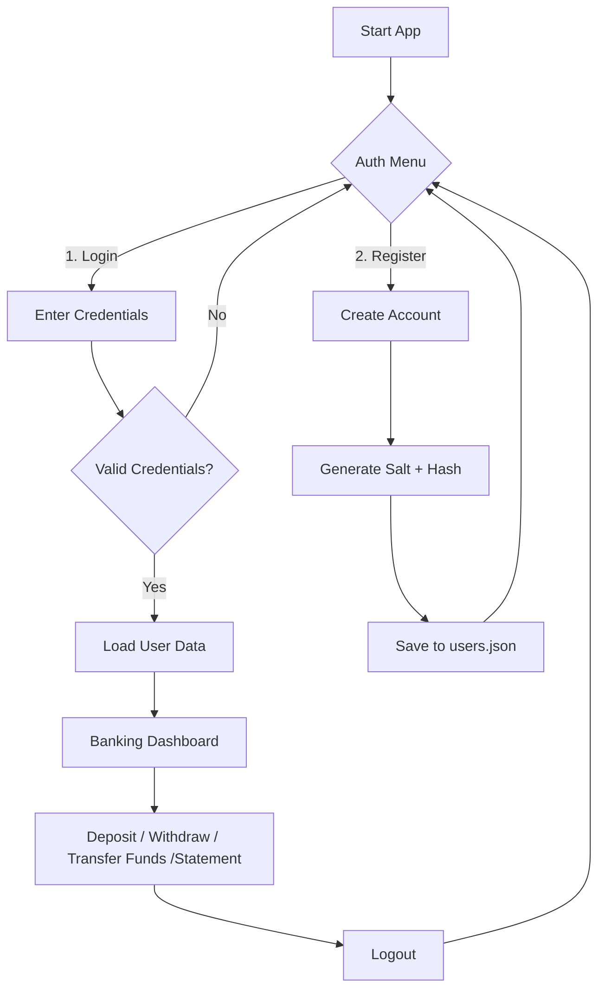
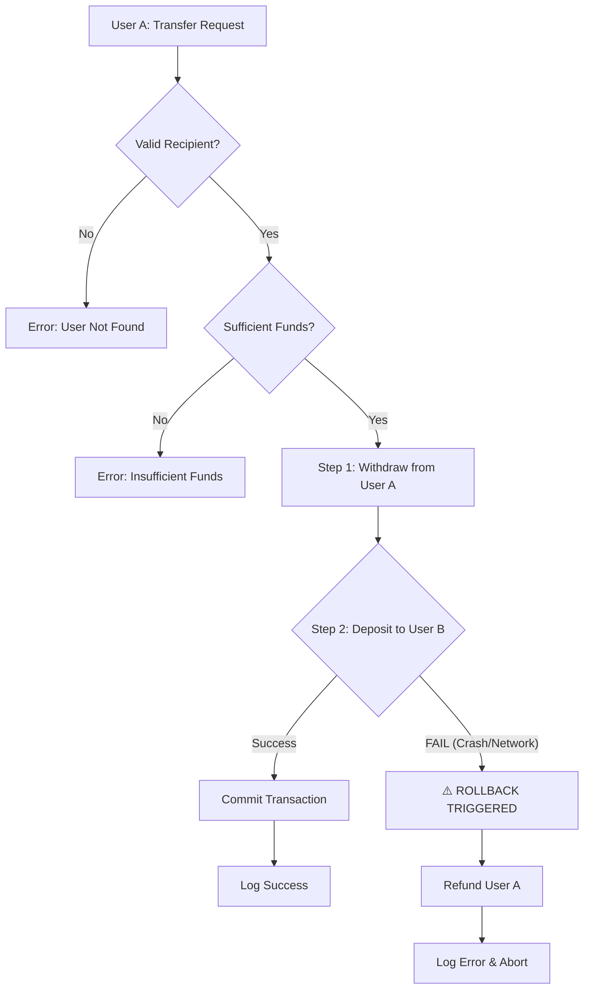

# FinCore-Ledger-System
A production-grade banking backend implementing robust OOP principles, transaction logging, and audit trails. Built with Python.

## 🚀 Key Features

* **OOP Architecture:** Encapsulated logic with private attributes to prevent direct state modification.
* **Robust Validation:** Prevents negative deposits and overdrafts with custom error handling.
* **Audit Logging:** Replaces standard `print` statements with Python's `logging` module to create a permanent, timestamped audit trail of all transactions in `logs/banking.log`.
* **Data Persistence:** Automated JSON file handling ensures account balances and transaction history survive program restarts.
* **Multi-Tenancy:** Supports multiple users with isolated transaction logs (`data/{username}.json`).
* **Secure Login:** Validates identity at startup to prevent data collision.
* **Interactive CLI:** A user-friendly terminal interface for depositing, withdrawing, and checking balances in real-time.
* **Transaction Ledger:** View a professional, formatted bank statement with a complete history of all deposits and withdrawals.
### 🔐 Security & Authentication
* **Secure Login:** Custom-built authentication system preventing unauthorized access.
* **Password Hashing:** Uses **SHA-256** with per-user **Random Salts** (16 bytes) to defeat Rainbow Table attacks.
* **Audit Logging:** Tracks all security events (Failed Logins, New Registrations) in `logs/banking.log`.
* **Safe Storage:** Credentials are never stored in plain text; only hashes persist in `data/users.json`.
B

## 🔐 Multi-User Support
The system now supports multiple distinct users on the same machine.
* **Login:** Upon startup, you will be prompted for a `username`.
* **Data Isolation:** Each user's data is stored in a unique file (e.g., `data/alice_transactions.json`).
* **Security:** Users cannot see or modify each other's balances.

### 💸 Banking Operations
* **Atomic Fund Transfers:** Users can transfer money to other registered users.
* **ACID Compliance:** Implements manual **Rollback Mechanisms**. If a transfer fails mid-operation (e.g., after deduction but before deposit), the system automatically refunds the sender to ensure data consistency.
* **Transaction History:** All transfers are logged in both users' transaction ledgers.

## 🔄 User Flow

## 🔄 Transaction Flow (ACID Architecture)


## 🛠️ How to Run
**1. Start the Application:**
```bash
   python main.py
```
**2. Interact:** 
Select Option 1 & 2 to Deposit or Withdraw.

Select Option 3 to print your full Transaction History.

Data is automatically saved to data/transactions.json

## 🧪 Running Tests
This project uses `pytest` for unit testing to ensure reliability.

**1. Install pytest:**
```bash
pip install pytest
```
**2. Run the test suite:**
```bash
python -m pytest
```
